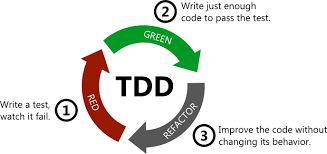
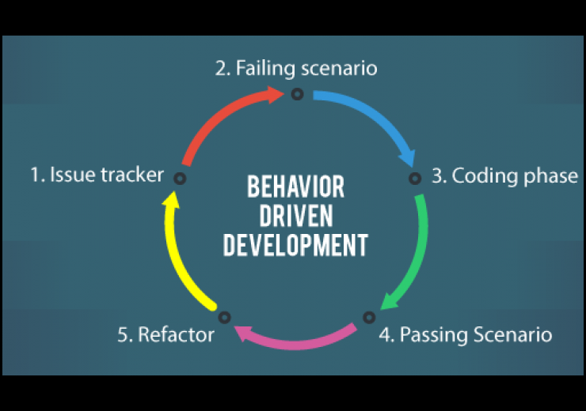
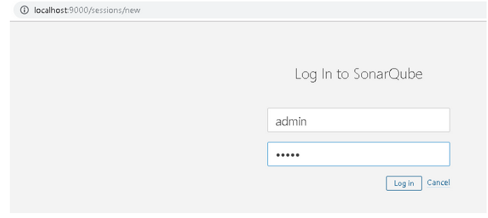

# TESTING PARA SISTEMAS DE INTERNET DE LAS COSAS - MIoT - FIUBA
---


Autor: FS - 2021

## TABLA DE CONTENIDO
---
1. [Introduccion General](#Introduccion)
2. [Instalacion de dependencias](#Dependencias)
2. [Organizacion del proyecto](#Organizacion)
3. [Test Driven Development - TDD](#TDD)
	* [Ejecucion del proyecto](#EjecucionTDD)
4. [Behavior Driven Development - BDD](#BDD)
	* [Ejecucion del proyecto](#EjecucioBDD)
5. [Sonarsube](#Sonarqube)
	* [Ejecución sonarqube](#EjecucionSonar)
6. [Licencia](#Licencia)

## Introduccion general

Los ***Trabajos practicos 2 y 3*** de la materia ***Testing para Sistemas de Internet de las Cosas*** consisten en el desarrollo de dos codigos en javascript empleando
las herramientas de testing ***Testing Driven Development(TDD)***  y ***Behavior Driven Development(BDD)***.  La carpeta TP5 consiste en casos de prueba llevados a cabo sobre el archivo peajes.py empleando la herramienta sonarqube.

## Instalacion de dependencias

Para poder ejecutar las pruebas, se requiere haber instalado **Node.js** junto con el gestor de paquetes 'npm'. Una vez hecho esto, se podra continuar con las indicaciones dadas en 


## Organizacion del proyecto

El proyecto se encuentra conformado por los siguientes directorios:

	TSIoT
	 │
	 │── Lista
  	 │	│── src
	 │	│     |── lista.js	
	 │	│── test
	 │	      |── test_lista.js	
	 │
	 │── ListaBDD
	 │	│── src
	 │	│     │── lista.js	
	 │	│── features
	 │		│── step_definitions
	 │		│		   │── lista_steps.js	
	 │		│
	 │		│── gestion.feature
     |     
	 |
	 |── TP5
	 |  |── docker-compose.yml
	 |  |── sonar-project.properties
	 |  |── peajes.py
	 |   
	 │
	 │── README.md
	 │
	 │── doc	

		
## Test Driven Development - TDD

Es una practica de programacion que consiste de en escribir primero las pruebas(generalmente unitarias), despues escribir el codigo fuente que pase la prueba satisfactoriamente y, por ultimo, refactorizar 
es codigo escrito. En la figura 1 se puede observar el paradigma de este tipo de testing.

Con esta practica se consigue entre otras cosas: un codigo mas robusto, mas seguro, mas mantenible y una mayor rapidez en el desarrollo.

<p align="center">
    <br>
    <b>Figura 1</b>. Desarrollo guiado por pruebas.
</p>

### Ejecucion del proyecto
Para llevar a cabo las pruebas, previamente se deberan realizar los siguientes pasos:

* Creacion del proyecto
	npm init

* Instalacion de los paquetes de prueba
	npm install --save mocha chai nyc

* Ajustes en el packet.json
	```
	"scripts": {
		"test": "mocha --reporter spec",
		"coverage": "nyc --reporter=html mocha"
	},
	```

## Behavior Driven Development - BDD

El Desarrollo guiado por comportamiento es una rama del Desarrollo guiado por pruebas. BDD es un conjunto de practicas de ingenieria de software diseñado 
para ayudar a los equipos de desarrollo a construir y desplegar software de mejor calidad y mas robusto. Una de las caracteristicas mas importantes de BDD es que proporciona un lenguaje comun basado en sentencias estructuradas en lenguaje nativo (lenguaje del desarrollador) que facilita la comunicacion entre miembros del equipo desarrollador y el ciente. 

El paradigma BDD se puede observar en la figura 2.


<p align="center">
    <br>
    <b>Figura 2</b>. Desarrollo guiado por comportamiento.
</p>


### Ejecucion del proyecto

Antes de realizar las pruebas se deben llevar a cabo los siguientes pasos:
    
* Creacion del proyecto
	npm init

* Instalacion de los paquetes de prueba
	npm install --save @cucumber/cucumber chai nyc

* Ajustes en el package.json
	```
	"scripts": {
		"test": "cucumber-js --publish-quiet",
		"coverage": "nyc --reporter=html cucumber-js --publish-quiet"
	},
	"nyc": {
	"exclude": "features/**"
	}
	c

## Sonarqube

Sonarqube es una plataforma de código abierto desarrollada por Sonarsources para inspección continua de calidad de código (revisión automática). El análisis es efectuado de forma estática con el objetivo de detectar *bugs*, *codigo smells* y vulnerabilidades de seguridad. En la figura 3 se podrá observar el resultado obtenido para uno de los códigos evaludados en este trabajo.

<p align="center">
    <br>
    <b>Figura 4</b>. Logueo en la página de Sonarqube.
</p>

### Ejecución sonarqube

Para adelantar las pruebas es necesario tener instalada la herramienta Sonarqube o usar algún contenedor (tipo Docker o Kubernetes). Para las pruebas realizadas en este trabajo, se optó por la segunda opción. Previamente se debe descargar la imagen(edición comunitaria). Para ello ejecutar en la terminal: 

```
docker pull sonarqube

```
Para la correcta ejecución de la imagen, el desarrollador recomienda los siguientes volumenes:
```
 *  /opt/sonarqube/conf: Para archivos de configuración como sonar.properties
 * /opt/sonarqube/data: archivos de la base de dato, como H2.
 * /opt/sonarqube/logs: contiene los logs de SonarQube acerca de procesos, acceso web, etc.
 * /opt/sonarqube/extensions: para *plugins* de terceros
```

Una vez contruido el archivo de docker compose y para ejecutar la imagen, correr en la terminal el siguiente comando:

```
docker-compose up
```

Posteriormente ir a la dirección: http://localhost:9000 y loguearse en la página de SonarQube (ver figura 4) con el usuario y claves creados.

<p align="center">
    <br>
    <b>Figura 3</b>. Login en la página de Sonarqube.
</p>


## LICENCIA
Este proyecto se encuentra publicado bajo la licencia MIT. En [este enlace](https://opensource.org/licenses/MIT) podrá encontrar más información sobre la misma.

